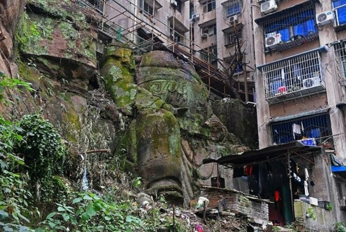
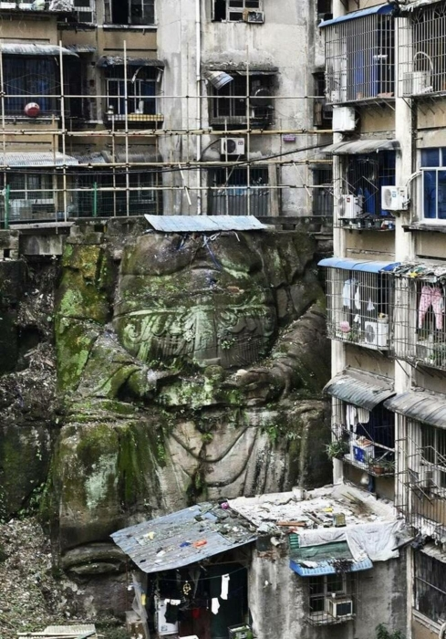
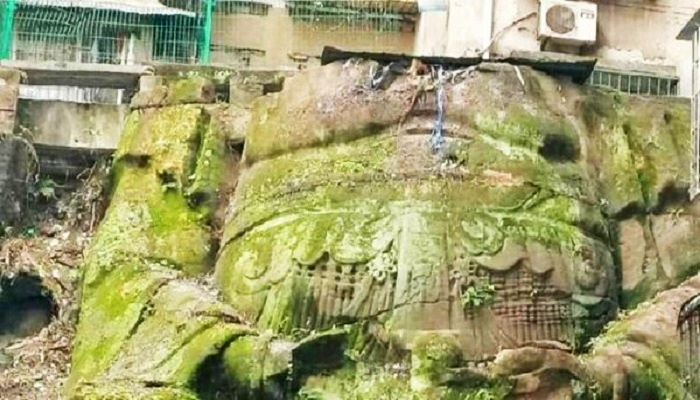

# An ancient statue of Buddha was found in China, propping up a ...high-rise building

In China, in one of the ancient districts of the city of Chongqing, during the clearing of the territory of an apartment complex accidentally discovered "decapitated" statue of the giant Buddha. The ancient archaeological artifact was part of the ...foundation of a high-rise building, hanging over a cliff. For decades, residents of the block have walked past the moss-covered rock and had no idea that the shrine that once belonged to the "Temple of the Sorrowful Ships" was underneath it.

An unusual case occurred in the historic Nanjing district of Chongqing, located in southwest China. While clearing the foundations of two multi-story houses located above a rocky cliff, a part of a Buddha statue carved out of stone was discovered. For many years, neither the tenants, art historians, nor the community authorities had any idea what was hidden beneath the thick moss and overgrowth. A trivial accident and utility workers helped, freeing the deity from the thicket. Thanks to their efforts, the citizens could see a 12-meter-high "decapitated" statue of Buddha.

Many believe that this is the Big Buddha Nanping, also called the Maitreya Buddha. Information found in the archives suggests that the stone statue was originally created in a niche and was 13.3 m high, 10.5 m wide and 3.5 m deep. And had it not been for the well-known events (Cultural Revolution) that took place in the country, the statue would have been intact to this day.

Synopsis: The Cultural Revolution in China, which took place from 1966 to 1976, caused considerable damage to the cultural and historical heritage of the country. All activities were conceived as "instilling the culture of the Communist Party in the minds of the Chinese people," with the almost total destruction of traditional Chinese customs, religion, and culture. Within one decade of Mao Zedong's Cultural Revolution, mainland China experienced a complete reorganization of values. At that time, monasteries, churches and other religious sites were destroyed, hundreds of thousands of Buddha statues were smashed, Buddha sutras were burned, monks were persecuted, etc. It was during this period that the pavilion with statues belonging to the Temple of Mourning Ships, built during the Ming Dynasty (1368 - 1644), was destroyed.

